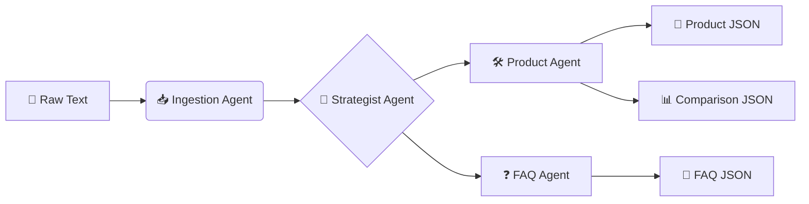

<div align="center">

# 🦜 Kasparro AI Agentic Content Generation System

[](https://python.org)
[](https://en.wikipedia.org/wiki/Multi-agent_system)
[](LICENSE)
[]()

> A modular, deterministic **Multi-Agent System (MAS)** that transforms raw product data into structured, machine-readable e-commerce content—**without LLMs**.

[View Documentation](docs/projectdocumentation.md) · [Report Bug](issues) · [Request Feature](issues)

</div>

---

## 🚀 Overview

**Kasparro** is an engineering solution designed to solve the challenge of autonomous content generation with absolute reliability. Unlike probabilistic LLM-based approaches, Kasparro uses a **deterministic pipeline** of specialized agents and logic blocks to ensure 100% hallucination-free output.

It autonomously orchestrates the ingestion, strategy, and assembly of:
- **📝 FAQ Pages** (Categorized & Contextual)
- **🛍️ Product Landing Pages** (Structured Metadata & Usage Specs)
- **⚖️ Comparison Pages** (Value Analysis vs. Synthetic Competitors)

---

## ⚡ Key Features

| Feature | Description |
| :--- | :--- |
| **🚫 No-LLM Architecture** | Relies on pure logic blocks for deterministic, safe, and verifiable results. |
| **🧠 Intelligent Logic** | "Muscles" that perform real-time math (Price Value Analysis) and semantic rule-checking. |
| **🧩 Modular Design** | Strict separation of concerns: **Agents** (Workflow) vs. **Logic** (Transformation) vs. **Templates** (Presentation). |
| **🔄 DAG Pipeline** | Unidirectional data flow: `Ingestion` → `Market Strategy` → `Content Assembly`. |

---

## 🛠️ System Architecture

The system operates on a 3-stage pipeline model:



### Core Components

- **Ingestion Agent**: Parses unstructured input into typed `Product` models.
- **Strategist Agent**: Generates synthetic competitors and user-centric questions.
- **Fx Blocks ("Muscles")**:
  - `calculate_price_diff`: Determines value propositions (e.g., "Premium" vs. "Better Value").
  - `generate_safety_warning`: Scans ingredients/side-effects for mandatory advisories.

---

## 📂 Repository Structure

```sh
kasparro-system/
├── docs/
│   └── projectdocumentation.md   # 📘 Detailed System Design
├── output/                       # 📤 Generated content (JSON)
├── src/
│   ├── agents/                   # 🤖 Autonomous workers
│   ├── blocks/                   # 🧠 Logic units (Math/Text)
│   ├── templates/                # 📏 Output schemas
│   ├── config.py                 # ⚙️ Configuration
│   └── models.py                 # 📦 Data Classes
└── main.py                       # 🎬 Orchestrator
```

---

## 🚀 Getting Started

### Prerequisites

- **Python 3.8+**
- Standard Library only (No heavy dependencies required).

### Installation

```bash
# Clone the repository
git clone https://github.com/your-username/kasparro.git

# Navigate to the project directory
cd kasparro
```

### Usage

Run the main orchestration script:

```bash
python main.py
```

### Expected Output

The agents will log their activities to the console, and 3 files will be generated in the `output/` directory:
1. `faq.json`
2. `product_page.json`
3. `comparison_page.json`

---

## 🤝 Contributing

Contributions are what make the open-source community such an amazing place to learn, inspire, and create. Any contributions you make are **greatly appreciated**.

1. Fork the Project
2. Create your Feature Branch (`git checkout -b feature/AmazingFeature`)
3. Commit your Changes (`git commit -m 'Add some AmazingFeature'`)
4. Push to the Branch (`git push origin feature/AmazingFeature`)
5. Open a Pull Request

---

<div align="center">

Built with ❤️ by **Rishabh Santosh** for the Applied AI Challenge.

</div>