<div align="center">

# 🦜 Kasparro AI: Generative Agentic System

[](https://python.org)
[](https://langchain-ai.github.io/langgraph/)
[](https://deepmind.google/technologies/gemini/)
[](https://github.com/your-username/kasparro)

> A state-of-the-art **Generative Multi-Agent System (MAS)** that uses LangGraph to orchestrate autonomous AI agents for structured content generation.

[View Documentation](docs/projectdocumentation.md) · [Report Bug](https://github.com/your-username/kasparro/issues) · [Request Feature](https://github.com/your-username/kasparro/issues)

</div>

---

## 🚀 Overview

agents powered by **Google Gemini 2.5**.

It autonomously transforms raw, messy product data into high-value marketing assets by:
1.  **Thinking:** Inventing realistic competitor products based on market context.
2.  **Reasoning:** Generating context-aware FAQ answers (e.g., dermatological advice).
3.  **Verifying:** Grounding AI hallucinations with deterministic logic tools.

---

## ⚡ Key Features

| Feature | Description |
| :--- | :--- |
| **🤖 Agentic Orchestration** | Powered by **LangGraph**, enabling state-driven workflows and complex agent handovers. |
| **🧠 Generative Reasoning** | Uses **Gemini 2.5 Pro** to hallucinate creative assets (Competitors) and answer nuanced queries. |
| **⚖️ Hybrid Logic** | Combines **LLM Creativity** with **Deterministic Tools** (Math/Set operations) for verifiable accuracy. |
| **🔒 Strict Validation** | Enforces 100% machine-readable JSON output using **Pydantic** parsers. |

---

## 🛠️ System Architecture

The system operates as a **StateGraph**, passing a shared memory object between nodes:

```mermaid
graph TD
    Start((Start)) --> Ingestion
    Ingestion["📥 Ingestion Agent<br/>(AI Extraction)"] --> Strategist
    
    Strategist["🧠 Strategist Agent<br/>(AI Creativity)"] --> Logic
    
    Logic["⚖️ Logic Engine<br/>(Deterministic Tool)"] --> Assembly
    
    Assembly["📝 Assembly Agent<br/>(Formatter)"] --> End((End))
```



### Core Components

- **Ingestion Agent**: Uses LLM to extract strict entities from unstructured text.
- **Strategist Agent**: Uses high-temperature AI calls to invent competitors and brainstorm user personas.
- **Logic Engine**: A deterministic node that performs math (Price Delta) and set operations (Ingredient Overlap) to ground the AI.
- **Assembly Agent**: Compiles the final shared state into production-ready JSON.

---

## 📂 Repository Structure

```bash
kasparro-system/
├── docs/
│   └── projectdocumentation.md   # 📘 Detailed System Design
├── output/                       # 📤 Generated content (JSON)
├── src/
│   ├── agents.py                 # 🤖 AI Nodes (Ingestion, Strategist, Assembly)
│   ├── logic_tools.py            # 🧠 Deterministic Math Tools
│   └── models.py                 # 📦 Pydantic Data Schemas
├── main.py                       # 🎬 LangGraph Orchestrator
└── requirements.txt              # 📦 Dependencies
```

---

## 🚀 Getting Started

### Prerequisites

- **Python 3.10+**
- **Google Gemini API Key**

### Installation

Clone the repository:

```bash
git clone https://github.com/rishabhkirito/kasparro-ai-agentic-content-generation-system-rishabh-santosh.git
cd kasparro-ai-agentic-content-generation-system-rishabh-santosh
```

Install dependencies:

```bash
pip install -r requirements.txt
```

Set up your API Key: Create a `.env` file in the root directory:

```env
GOOGLE_API_KEY=your_actual_api_key_here
```

### Usage

Run the graph orchestration script:

```bash
python main.py
```

### Expected Output

The system will visualize the graph execution flow in the console and generate 3 files in `output/`:

1.  `faq.json` (Context-aware Q&A)
2.  `product_page.json` (Cleaned Data)
3.  `comparison_page.json` (AI-Generated Competitor Analysis)

---

<div align="center">

Built by **Rishabh Santosh** · Powered by **LangGraph** & **Gemini**.

</div>