<div align="center">

# 🦜 Kasparro AI: Generative Agentic System

[](https://python.org) [](https://langchain-ai.github.io/langgraph/) [](https://deepmind.google/technologies/gemini/) []()

> A state-of-the-art **Generative Multi-Agent System (MAS)** that uses LangGraph to orchestrate autonomous AI agents for structured content generation.

[View Documentation](docs/projectdocumentation.md) · [Report Bug](issues) · [Request Feature](issues)

</div>

---

## 🚀 Overview

**Kasparro AI** is an advanced engineering solution designed to solve the challenge of autonomous content generation with absolute reliability. Unlike simple scripts, this system utilizes a **Self-Correcting Directed Acyclic Graph (DAG)** of cognitive agents powered by **Google Gemini**.

It autonomously transforms raw, messy product data into high-value marketing assets by:

1.  **Thinking:** Inventing realistic competitor products based on market context.
2.  **Reasoning:** Generating context-aware FAQ answers (e.g., dermatological advice).
3.  **Reflecting:** Critiquing its own work and autonomously retrying if quality standards aren't met.
4.  **Verifying:** Grounding AI hallucinations with deterministic logic tools.

---

## ⚡ Key Features

| Feature | Description |
| :--- | :--- |
| **🤖 Agentic Orchestration** | Powered by **LangGraph**, enabling state-driven workflows and complex agent handovers. |
| **🔄 Self-Correction Loop** | Includes a **Critic Node** that rejects low-quality output and forces the Strategist agent to retry. |
| **🧠 Generative Reasoning** | Uses **Gemini Pro** to hallucinate creative assets (Competitors) and answer nuanced queries. |
| **⚖️ Hybrid Logic** | Combines **LLM Creativity** with **Deterministic Tools** (Math/Set operations) for verifiable accuracy. |
| **🔒 Strict Validation** | Enforces 100% machine-readable JSON output using **Pydantic** parsers. |

---

## 🛠️ System Architecture

The system operates as a **StateGraph** with a feedback loop. If the QA Agent rejects the output (e.g., "Not enough FAQs"), the workflow cycles back to the Strategist.

```mermaid
graph TD
    Start((Start)) --> Ingestion
    Ingestion["📥 Ingestion Agent<br/>(AI Extraction)"] --> Strategist
    
    Strategist["🧠 Strategist Agent<br/>(AI Creativity)"] --> QA
    
    QA{"🕵️ QA & Critic<br/>(Quality Gate)"} 
    
    QA -- "❌ Fail (Retry)" --> Strategist
    QA -- "✅ Pass" --> Logic
    
    Logic["⚖️ Logic Engine<br/>(Deterministic Tool)"] --> Assembly
    
    Assembly["📝 Assembly Agent<br/>(Formatter)"] --> End((End))
    
    %% Styling
    style QA fill:#ffcdd2,stroke:#b71c1c,stroke-width:2px
    style Strategist fill:#f3e5f5,stroke:#4a148c,stroke-width:2px
```



### Core Components

- **Ingestion Agent:** Uses LLM to extract strict entities from unstructured text.
- **Strategist Agent:** Uses high-temperature AI calls to invent competitors and brainstorm user personas. Reads critique to improve content.
- **QA & Critic Agent:** A semantic evaluator that grades content quality and enforces constraints (e.g., "Must have 15+ FAQs"). Triggers retries if standards aren't met.
- **Logic Engine:** A deterministic node that performs math (Price Delta) and set operations (Ingredient Overlap) to ground the AI.
- **Assembly Agent:** Compiles the final shared state into production-ready JSON.

---

## 📂 Repository Structure

```bash
kasparro-system/
├── docs/
│   └── projectdocumentation.md   # 📘 Detailed System Design
├── output/                       # 📤 Generated content (JSON)
├── src/
│   ├── agents.py                 # 🤖 AI Nodes (Ingestion, Strategist, QA, Assembly)
│   ├── logic_tools.py            # 🧠 Deterministic Math Tools
│   └── models.py                 # 📦 Pydantic Data Schemas
├── tests/
│   └── test_system.py            # 🧪 Unit Tests for Logic & Constraints
├── main.py                       # 🎬 LangGraph Orchestrator
└── requirements.txt              # 📦 Dependencies
```

## 🚀 Getting Started

### Prerequisites

- **Python 3.10+**
- **Google Gemini API Key**

### Installation

Clone the repository:

```bash
git clone https://github.com/your-username/kasparro.git
cd kasparro
```

Install dependencies:

```bash
pip install -r requirements.txt
```

Set up your API Key: Create a `.env` file in the root directory:

```env
GOOGLE_API_KEY=your_actual_api_key_here
```

### Usage

1. **Run the Main Agent System:** Run the graph orchestration script to generate content:

```bash
python main.py
```

2. **Run the Test Suite:** Verify the deterministic logic and constraints using the built-in testing framework:

```bash
python -m unittest tests/test_system.py
```

### Expected Output

The system will visualize the graph execution flow in the console and generate 3 files in `output/`:

1. `faq.json` (Context-aware Q&A)
2. `product_page.json` (Cleaned Data)
3. `comparison_page.json` (AI-Generated Competitor Analysis)

---

<div align="center">

Built by **Rishabh Santosh** · Powered by **LangGraph** & **Gemini**.

</div>