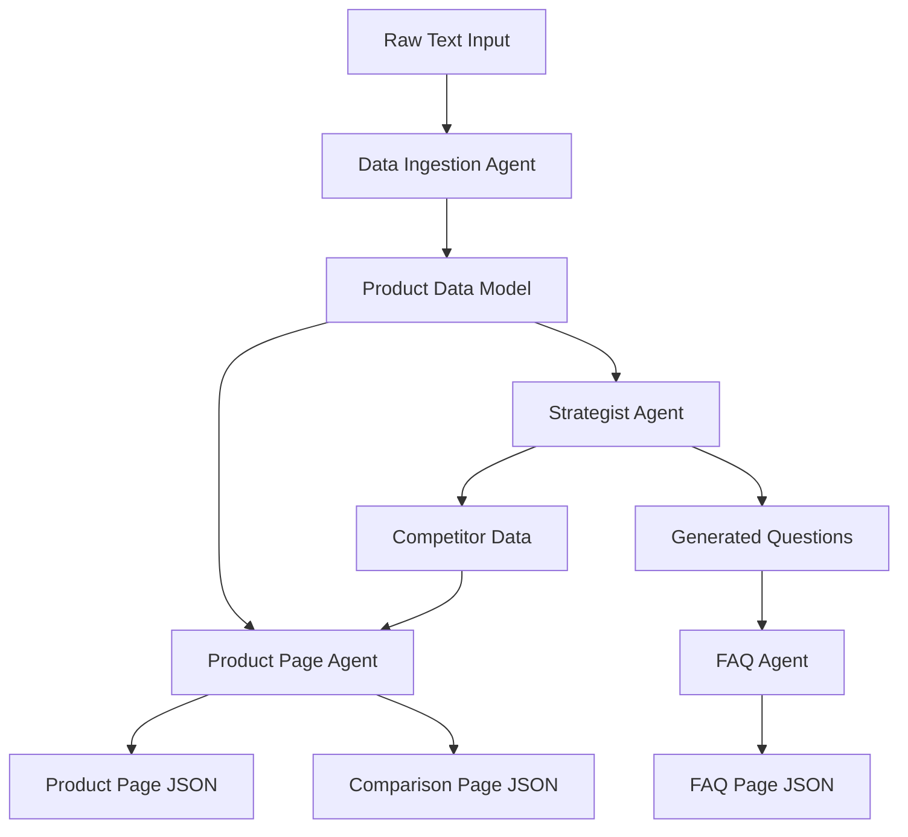

# System Design Document: Kasparro AI Agentic Content Generation System

## 1. System Overview
The **Kasparro AI Agentic Content Generation System** is a modular, agent-based framework designed to automatically generate high-quality e-commerce content. It takes unstructured product data as input and produces structured, ready-to-deploy JSON content for Product Landing Pages, Comparison Pages, and FAQ sections.

The system emphasizes **modularity**, **reusability**, and **separation of concerns** by dividing responsibilities among specialized Agents, reusable Logic Blocks, and strict Output Templates.

## 2. Architecture

The system follows a pipeline architecture where data flows through a series of specialized agents.



## 3. Core Components

### 3.1 Agents
Agents are the high-level orchestrators that satisfy specific business requirements.

| Agent | File | Responsibility | key Logic |
|-------|------|----------------|-----------|
| **Data Ingestion Agent** | `src/agents/ingestion_agent.py` | Parsers raw text into structured objects. | Simple line-by-line parsing to extract fields like Price, Ingredients, and Benefits. |
| **Strategist Agent** | `src/agents/strategist_agent.py` | Generates synthetic content (Competitors & FAQs). | Uses slot-filling logic to generate 15+ categorized questions (Informational, Usage, Safety, Purchase) and constructs fictional competitor products. |
| **Product Page Agent** | `src/agents/product_agent.py` | Assembles Product and Comparison pages. | Uses `math_utils` for price comparisons and `text_utils` for formatting usage instructions. Renders output using strict templates. |
| **FAQ Agent** | `src/agents/faq_agent.py` | Organizes and renders the FAQ section. | Groups questions by category and formats them into the required JSON structure. |

### 3.2 Logic Blocks ("Muscles")
Reusable utility functions that perform specific data transformations. These are domain-agnostic where possible.

- **`src/blocks/math_utils.py`**:
    - `calculate_price_diff()`: Computes price difference and determines "Better Value" or "Premium Choice" verdict.
    - `compare_ingredients()`: Finds common and unique ingredients between two products.
- **`src/blocks/text_utils.py`**:
    - `format_usage_instructions()`: Converts raw paragraph text into structured step-by-step lists.
    - `generate_safety_warning()`: Generates advisory objects based on side effects.
    - `parse_comma_list()`: Cleans and splits comma-separated strings.

### 3.3 Templates ("Skeleton")
Classes that define the strict schema for the output JSON. They ensure consistency across all generated content.

- **`src/templates/schemas.py`**:
    - `ProductPageTemplate`: Structure for the main landing page (Hero, Details, Instructions, Safety).
    - `ComparisonPageTemplate`: Structure for side-by-side product comparison.
    - `FAQTemplate`: Structure for categorized Q&A lists.
    - `BaseTemplate`: Adds standard metadata (version, generated_by) to all outputs.

## 4. Data Models

The system uses Python `dataclasses` to ensure type safety and structured data passing between agents. Defined in `src/models.py`.

- **`Product`**:
    - Fields: `name`, `price`, `currency`, `concentration`, `skin_type`, `ingredients`, `benefits`, `how_to_use`, `side_effects`.
- **`Question`**:
    - Fields: `category`, `question_text`, `answer_text`.

## 5. Directory Structure
```
src/
├── agents/         # Orchestrators (Ingestion, Strategist, Product, FAQ)
├── blocks/         # Reusable logic (Math, Text utils)
├── templates/      # Output schemas (JSON structures)
├── config.py       # Configuration and constants
├── models.py       # Data classes (Product, Question)
└── __init__.py
```