# System Design Document: Kasparro AI Agentic Content Generation System

## 1. System Overview
The **Kasparro AI Agentic Content Generation System** is an advanced, generative framework designed to autonomously create high-quality e-commerce content. Unlike simple template-based scripts, this system utilizes a **Directed Acyclic Graph (DAG)** of cognitive agents powered by **Google Gemini 1.5 Pro**.

The system takes unstructured, raw product text as input and employs a shared state machine to orchestrate complex tasks:
1.  **Thinking:** Inventing realistic competitor products based on market context.
2.  **Reasoning:** Generating context-aware FAQ answers (e.g., specific dermatological advice).
3.  **Verifying:** Grounding AI hallucinations with deterministic logic tools.

## 2. Architecture (LangGraph DAG)

The system is built on **LangGraph**, utilizing a StateGraph architecture where a shared memory object (`AgentState`) is passed between specialized nodes.

```mermaid
graph TD
    Start((Start)) --> Ingestion
    Ingestion["📥 Ingestion Agent<br/>(LLM Extraction)"] --> Strategist
    
    Strategist["🧠 Strategist Agent<br/>(LLM Creativity)"] --> Logic
    
    Logic["⚖️ Logic Engine<br/>(Deterministic Tool)"] --> Assembly
    
    Assembly["📝 Assembly Agent<br/>(Formatter)"] --> End((End))
    
    subgraph "Shared Memory (AgentState)"
    Product_Model
    Competitor_Model
    Questions_List
    Analysis_Data
    end
```



## 3. Core Components

### 3.1 Agents (Graph Nodes)
Agents are the autonomous nodes in the graph, each responsible for a specific cognitive or functional task. They are defined in `src/agents.py`.

| Agent Node | Type | Responsibility | Key Logic |
| :--- | :--- | :--- | :--- |
| **Ingestion Agent** | **LLM Extraction** | Cleans messy text into strict `Product` objects. | Uses Pydantic extraction with Gemini to parse unstructured text into a validated schema. |
| **Strategist Agent** | **LLM Creative** | Invents content that doesn't exist in the source. | Uses high-temperature LLM calls to **hallucinate** a fictional competitor and brainstorm user personas/questions. |
| **Logic Engine** | **Deterministic Tool** | Grounds the AI with math and facts. | Calls pure Python functions (`calculate_price_delta`) to verify the AI's "Better Value" claims mathematically. |
| **Assembly Agent** | **Formatter** | Compiles the final state into output files. | Aggregates the accumulated state and renders it into the final 3 JSON formats. |

### 3.2 Logic Tools ("Muscles")
Reusable, deterministic utility functions that verify or transform data. Defined in `src/logic_tools.py`.

* **`calculate_price_delta(p1, p2)`**:
    * *Role:* Computes the exact price difference between the Product and the AI-generated Competitor.
    * *Output:* Returns metrics like `diff`, `is_cheaper`, and `percent_diff`.
* **`extract_ingredient_overlap(list1, list2)`**:
    * *Role:* Performs set operations to find common vs. unique ingredients.
    * *Output:* Used to generate the "Advantage Summary" in the comparison page.

### 3.3 Data Models (Schema)
The system uses **Pydantic** models to enforce strict types and ensure the LLM outputs machine-readable JSON. Defined in `src/models.py`.

* **`Product`**:
    * Fields: `name`, `price`, `currency`, `concentration`, `skin_type`, `ingredients`, `benefits`, `how_to_use`, `side_effects`.
* **`Competitor` (Inherits Product)**:
    * Adds: `reason_for_creation` (Why the AI chose this specific competitor strategy).
* **`AgentState`**:
    * The "Brain" of the graph. It holds the `raw_input`, `product` object, `competitor` object, and `questions` list as they are built up step-by-step.

## 4. Directory Structure
The project follows a flat, modular structure optimized for LLM agent workflows.

```text
src/
├── agents.py       # The "Nodes" of the graph (Ingestion, Strategist, etc.)
├── logic_tools.py  # The "Tools" (Math, Set operations)
├── models.py       # The "Schema" (Pydantic models)
├── __init__.py
```

## 5. Technology Stack
- **Orchestration**: LangGraph (State-of-the-art agent framework)
- **LLM**: Google Gemini 1.5 (via langchain-google-genai)
- **Validation**: Pydantic (Data integrity)
- **Language**: Python 3.10+